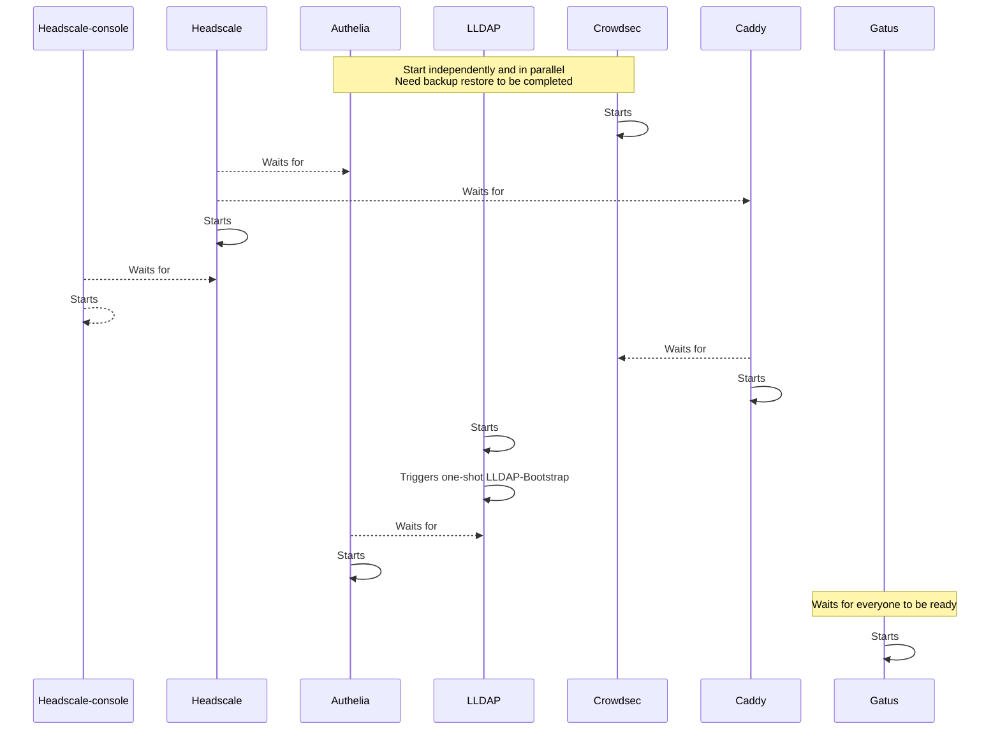

# Containers boot sequence

```mermaid
sequenceDiagram
    participant Headscale-console
    participant Headscale
    participant Authelia
    participant LLDAP
    participant Crowdsec
    participant Caddy
    participant Gatus

    Note over Authelia, Crowdsec: Start independently and in parallel<br/>Need backup restore to be completed

    Crowdsec->>Crowdsec: Starts

    Headscale-->>Authelia: Waits for
    Headscale-->>Caddy: Waits for
    Headscale->>Headscale: Starts
    Headscale-console-->>Headscale: Waits for
    Headscale-console-->>Headscale-console: Starts

    Caddy-->>Crowdsec: Waits for
    Caddy->>Caddy: Starts

    LLDAP->>LLDAP: Starts
    LLDAP->>LLDAP: Triggers one-shot LLDAP-Bootstrap

    Authelia-->>LLDAP: Waits for
    Authelia->>Authelia: Starts

    Note over Gatus: Waits for everyone to be ready
    Gatus->>Gatus: Starts
```
